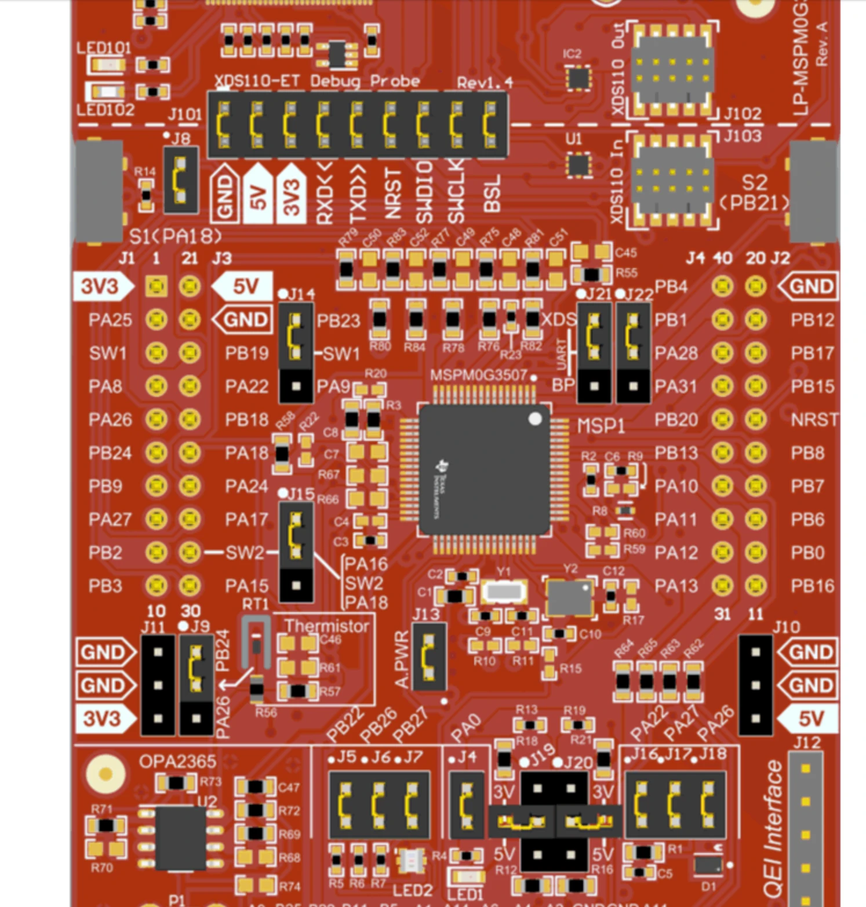

# Saleae Hardware-in-the-Loop (HIL) Compliance — Setup & Run Guide

This firmware (`saleae_hil_compliance`) turns an MSPM0G3507 LaunchPad into a DCC
command-station device-under-test (DUT) that the Python compliance harness drives over
UART while a Saleae logic analyzer wire-verifies the DCC output against the NMRA specs
(S-9.1 / S-9.2 / S-9.2.1 / S-9.3.2, with S-9.2.3 service mode in progress).

```
  ┌─────────────┐   USB-CDC UART (230400)    ┌──────────────────────┐
  │  Python      │ ─────────────────────────►│  MSPM0G3507 LaunchPad │
  │  harness     │   "SPEED 3 64 FWD" etc.   │  (this firmware)      │
  │ (test/       │◄───────────────────────── │                       │
  │  compliance) │   "OK: ..." responses     └───────┬───────────────┘
  └──────┬───────┘                                   │ DCC out (PB1), trigger (PB3)
         │ logic2-automation gRPC (port 10430)       ▼
  ┌──────▼───────┐                            ┌──────────────┐
  │  Saleae       │◄───────── probes ─────────│  Saleae Logic │
  │  Logic 2 app  │                           │  analyzer     │
  └───────────────┘                           └──────────────┘
```

The harness sends a command, the Saleae captures the resulting DCC waveform, and the
suite decodes the bits and checks them against the spec. The firmware pulses a **test
trigger** (PB3) on the packet under test so the analyzer can hardware-trigger on the exact
packet.

---

## 0. Quick re-setup checklist (after travel)

Tear-down: just unplug. Nothing is stored on the bench except the firmware (already in the
LaunchPad flash) and the Python venv (in this repo). To bring it back up:

1. **USB:** plug in the **LaunchPad** (XDS110 — gives the UART + flashing) and the **Saleae**.
2. **Probe wires** (Saleae → LaunchPad), common ground first. Wire colors are the bench's
   Saleae harness colors:
   - **GND → GND** — gray
   - **D0 → PB1** — black (main DCC out)
   - **D1 → PB3** — brown (test trigger / PACKET_LOAD)
   - **D2 → PB2** — red (RailCom cutout-active strobe / DCC_MIRROR)
   - **D3 → PB4** — orange (service-track DCC out)
   - **D4 → PB9** — yellow (mock-ACK pin; for the S-9.2.3 ACK width cross-check)
   - **D5 → PB18** — green (RailCom Rx-window mirror / RAILCOM_RX_WINDOW; for the S-9.3.2 cutout sub-windows)
   - **D6 → PB16** — blue (RailCom RX loopback / RAILCOM_RX; for the S-9.3.2 receive-path checks)
   - **Jumpers:** PB24 → PB9 (mock ACK) and **PB6 → PB16** (mock RailCom decoder → RailCom RX)
3. **Logic 2:** launch it; Preferences → **Automation** → enable the API (port **10430**). Leave it running.
4. **Firmware:** already flashed. If the board was wiped, re-flash the `saleae_hil_compliance`
   Debug build from CCS. (After any service-mode test, tap **RESET** to clear singleton state.)
   - **Rebuild + reflash required** for the newest checks: the RailCom receive-path
     loopback (`RC MOCK`, UART1/UART2 on PB6/PB16 in SysConfig), the S-9.3.2 cutout
     sub-window timing (D5/PB18 mirror), the S-9.2.3 interrupted-ACK test (`SVC MOCKACK
     <us> GLITCH <gap>`), and the `SVC REG/PAGED BITW|BITR` commands. CCS regenerates the
     pin/UART config from the SysConfig on build.
5. **Preflight:** `cd test/compliance && .venv/bin/python command_station/bench_preflight.py`
   — checks the DUT UART, the Saleae, and every probe channel, and names the wire colour +
   header pin of anything missing. Fix the bench until it passes.
6. **Run:** `.venv/bin/python command_station/run_all.py` (or `--preflight` to fold step 5 in;
   single suite, e.g. `.venv/bin/python command_station/s9_2_1_compliance.py`). If the venv is missing, recreate it — §3c.

That's the whole bench. Details, troubleshooting, and the pending mock-ACK item are below.

---

## 1. Hardware needed

- **MSPM0G3507 LaunchPad** (LP-MSPM0G3507) flashed with this `saleae_hil_compliance` firmware.
- **Saleae Logic** analyzer (original Logic or Logic Pro) + the **Logic 2** desktop app.
- A few jumper wires and a common ground between the Saleae and the LaunchPad.
- USB cables: one for the LaunchPad (XDS110 USB-CDC UART + flashing), one for the Saleae.

## 2. Wiring

Connect the Saleae digital channels to the LaunchPad pins and tie grounds together:

| Saleae channel | Wire   | LaunchPad pin | Signal                         | Used by                         |
|:--------------:|:------:|:-------------:|--------------------------------|---------------------------------|
| **D0 (ch 0)**  | black  | **PB1**       | DCC main-track output          | all suites                      |
| **D1 (ch 1)**  | brown  | **PB3**       | Test trigger (PACKET_LOAD)     | triggered captures              |
| **D2 (ch 2)**  | red    | **PB2**       | RailCom cutout-active strobe (DCC_MIRROR) | S-9.3.2 cutout timing |
| **D3 (ch 3)**  | orange | **PB4**       | DCC service-track output       | S-9.2.3 service mode            |
| **D4 (ch 4)**  | yellow | **PB9**       | Mock-ACK pin (PB24→PB9 loopback) | S-9.2.3 ACK width cross-check |
| **D5 (ch 5)**  | green  | **PB18**      | RailCom Rx-window mirror (RAILCOM_RX_WINDOW) | S-9.3.2 cutout sub-windows |
| **D6 (ch 6)**  | blue   | **PB16**      | RailCom RX loopback (RAILCOM_RX; PB6→PB16 jumper) | S-9.3.2 receive path |
| **GND**        | gray   | **GND**       | common ground                  | always                          |

These eight (D0–D6, GND) plus the two jumpers are the **current working setup** — wire all of them
on re-assembly. The loopback channel (6) is set in `command_station/s9_3_2_compliance.py`
(`LOOPBACK_CHANNEL`). The channel-to-pin map lives at the top of `test/compliance/compliance_lib.py`
(`DIGITAL_CHANNEL`=0, `TRIGGER_CHANNEL`=1); the S-9.3.2 cutout channel (2) and Rx-window
channel (5) are set in `command_station/s9_3_2_compliance.py` (`CUTOUT_CHANNEL`, `WINDOW_CHANNEL`), and the
S-9.2.3 service channel (3) and mock-ACK channel (4) in `command_station/s9_2_3_compliance.py`
(`SERVICE_CHANNEL`, `ACK_CHANNEL`).

> **RailCom Rx-window mirror (D5/PB18).** PB2 (D2) marks only the cutout envelope
> (begin T_CS / end T_CE). PB18 mirrors the cutout's `uart_rx_enable`/`uart_rx_disable`
> hooks — it goes high while each RailCom channel window (Ch1, Ch2) is open — so the
> Saleae can time the three interior boundaries (T_TS1/T_TC1/T_TS2). Together with D2 the
> suite reconstructs all five cutout states (S-9.3.2 CS-005/006). The pin is defined as
> **RAILCOM_RX_WINDOW** in the `GPIO_GRP_SALEAE` group in SysConfig; until it exists the
> firmware mirror compiles as a no-op and the sub-window checks report the pin as absent.

> **RailCom receive loopback (D6/PB16 + jumper PB6→PB16).** The DUT's real RailCom
> receive path is a 250 kbaud UART on **PB16** (`RAILCOM_RX`, UART2), gated by the
> library's own channel-window hooks. A **mock decoder transmitter** on **PB6**
> (`MOCK_RC_TX`, UART1) is jumpered into it; `RC MOCK <ch1hex> [<ch2hex>] [LATE]` arms one
> reply that the next cutout plays at T_TS1 (Ch1) and T_TS2 (Ch2), exactly where a decoder
> transmits. The library decodes it and the firmware prints `RC RESULT: addr=.. ch=.. id=..
> data=..`. D6 taps PB16 so the suite checks the bytes, their 250 kbaud framing and their
> position inside the D5 windows independently of the firmware. No bit-banging: both ends
> are hardware UARTs. `RC MOCK OFF` disarms and zeroes the counters, `RC STATUS` shows them.

> The **mock-ACK loopback** for the S-9.2.3 ACK test is an on-board **jumper**
> **MOCK_ACK_DRIVE (PB24) → MOCK_ACK (PB9)**; **D4 taps PB9** so the suite independently
> measures the injected pulse width. See below and
> `documentation/compliance/ComplianceOverview.md`.

> Ground first. A missing common ground gives garbled or absent captures.

### LaunchPad header locations

Where the wired pins sit on the LaunchPad's 40-pin BoosterPack headers, so you can find them
with a wire in hand. Orient the board with the **USB connector at the top**. Each side has two
10-pin columns: **left = J1 (outer) / J3 (inner)**, **right = J2 (outer) / J4 (inner)**. J1.1,
J3.21, J4.40 and J2.20 are all in the **top row**, matching the silkscreen next to the headers.

| MCU pin | Header | Row from top | Side / column | Signal | Saleae |
|:--:|:--:|:--:|---|---|---|
| PB1  | J4.39 | 2  | right, inner | main-track DCC (MAIN_DCC)         | D0 black  |
| PB3  | J1.10 | 10 | left, outer  | test trigger (PACKET_LOAD)        | D1 brown  |
| PB2  | J1.9  | 9  | left, outer  | cutout strobe (RAILCOM_CUTOUT)    | D2 red    |
| PB4  | J4.40 | 1  | right, inner | service-track DCC (SERVICE_MODE_DCC) | D3 orange |
| PB9  | J1.7  | 7  | left, outer  | mock-ACK in (MOCK_ACK)            | D4 yellow |
| PB18 | J3.25 | 5  | left, inner  | Rx-window mirror (RAILCOM_RX_WINDOW) | D5 green |
| PB16 | J2.11 | 10 | right, outer | RailCom RX (RAILCOM_RX) — jumper target | D6 blue |
| PB6  | J2.13 | 8  | right, outer | mock RailCom TX (MOCK_RC_TX) — jumper to J2.11 | — |
| GND  | J3.22 or J2.20 | 2 / 1 | left inner / right outer | ground     | gray      |
| PB24 | J1.6  | 6  | left, outer  | mock-ACK drive (MOCK_ACK_DRIVE) — jumper to J1.7 | — |
| PB12 | J2.19 | 2  | right, outer | real ACK current-sense (ACK_IN)   | —         |
| PA15 | J3.30 | 10 | left, inner  | ISR timing scope aid (ISR_TIME)   | —         |

Notes:
- The **mock-ACK loopback jumper is J1.6 → J1.7**, two adjacent pins in the same column.
- The **RailCom loopback jumper is J2.13 → J2.11**, two pins apart in the right outer column;
  the blue D6 clip shares J2.11 with the jumper end, like the yellow clip on J1.7.
- **PB24** also feeds the on-board thermistor divider through jumper **J9** by default. Pull J9
  to isolate it if the mock-ACK pulse ever looks loaded.
- **PB18** and **PA15** pass through two fitted 0 Ω resistors each (the "RC filter" footprints);
  the filter capacitors are unpopulated, so the pins are effectively direct.
- **PA10/PA11** (UART_CMD) appear on J4.34/J4.33, but jumpers **J21/J22** route them to the
  XDS110 backchannel by default. Leave them alone — the harness talks over USB.
- The LED pins (PB22/PB26/PB27) are not on the 40-pin headers.



*LP-MSPM0G3507 board silkscreen (Texas Instruments), header labels as printed on the board.
Left pair: J1 is the outer column, J3 the inner; a row's left label is the J1 pin, its right
label the J3 pin (row 5: PA26 outer, **PB18 inner**). Right pair: J4 inner, J2 outer. Header
numbering cross-checked against TI SLAU873E Fig 2-10. Reproduced for bench reference only.*

### Mock-ACK loopback for the S-9.2.3 ACK test (one jumper)

The service-track channel (ch3/PB4) drives the s9_2_3 packet + parallel-track-timing checks.
The **ACK-detection boundary tests** add one on-board jumper — no extra Saleae channel:

1. **Service track on ch3/PB4** (already wired). Service-mode packets (≥20-bit preamble)
   come out here, separate from the main track.

2. **Mock-ACK loopback jumper — PB24 → PB9.** Two GPIOs in the `GPIO_GRP_SALEAE` group:
   - **MOCK_ACK_DRIVE (PB24) — output.** The HIL firmware pulses it for a controlled width
     (via `SVC MOCKACK <width_us>`) during a Direct bit-verify.
   - **MOCK_ACK (PB9) — input.** `current_sense_read()` reads it as the ACK current-sense
     substitute. A **jumper wire from PB24 to PB9** loops the driven pulse back in, so the
     library's ACK width counter validates the 6 ms ± 1 ms window — no decoder required.

3. **Probe the mock-ACK pin on D4/ch4 (PB9).** The suite captures D4 during each `SVC MOCKACK`
   op and independently measures the high-pulse width, cross-checking it against the value
   requested — so a pass means the firmware really produced that pulse, not just that the
   UART said so.

```
SVC MOCKACK <us> ─► MOCK_ACK_DRIVE (PB24) ──jumper──► MOCK_ACK (PB9) ─► current_sense_read() ─► ack_sample()
                                                            └─────────► Saleae ch 4  (independent width measure)
service track (PB4) ───────────────────────────────► Saleae ch 3       (decode service-mode packets)
```

Run the boundary suite with `command_station/s9_2_3_compliance.py`; the design is specced in
`documentation/compliance/ComplianceOverview.md` (“ACK Pulse-Width Verification”).

## 3. Software prerequisites

**a) Code Composer Studio** to build and flash this firmware (see §4).

**b) Saleae Logic 2** with the **Automation API enabled**:
- Logic 2 → Preferences → **Automation** → enable the API server.
- It listens on gRPC port **10430** (this is the automation port, *not* the MCP port 10530).
- Leave the Logic 2 app **running** while you run the suites.

**c) Python venv** for the harness (one-time), created under `test/compliance/.venv`:

```bash
cd test/compliance
python3 -m venv .venv
.venv/bin/pip install logic2-automation pyserial
```

## 4. Flash the firmware

1. Open the `saleae_hil_compliance` project in Code Composer Studio.
2. Build the **Debug** configuration (it uses the `dcc_lib` symlink to `src/dcc`).
3. Flash to the LaunchPad.

The firmware boots with the track powered **off**; the harness powers it on over UART.

## 5. Run the compliance tests

All commands run from `test/compliance/`. The DUT serial port is **auto-detected** among
`/dev/cu.usbmodem*` at **230400 baud** — no need to specify it normally.

**Check the bench first** (after any re-wiring):
```bash
cd test/compliance
.venv/bin/python command_station/bench_preflight.py
```
It stops at the first layer that fails — DUT UART, then Logic 2 / Saleae, then each probe
channel — and prints a per-channel table with the wire colour and header pin. Everything
below assumes it passes.

**Run everything:**
```bash
cd test/compliance
.venv/bin/python command_station/run_all.py            # add --preflight to run the bench check first
```

**Run a single spec suite:**
```bash
.venv/bin/python command_station/s9_2_1_compliance.py      # S-9.2.1 extended packet formats
.venv/bin/python command_station/s9_1_compliance.py        # S-9.1 electrical/timing
.venv/bin/python command_station/s9_2_compliance.py        # S-9.2 baseline packets
.venv/bin/python command_station/s9_3_2_compliance.py      # S-9.3.2 RailCom
```

Each suite:
1. opens the DUT UART and powers the track on,
2. sends commands and captures the DCC wire via the Saleae,
3. decodes and checks each packet against the spec,
4. prints a pass/fail summary and writes an HTML report.

## 6. Results

- Console prints per-check `PASS` / `FAIL` / `n/a` and an overall summary.
- A timestamped HTML report is written to **`test/compliance/reports/*.html`**
  (combined report for `command_station/run_all.py`, per-suite for a standalone run).

## 7. Useful config knobs

Top of `test/compliance/compliance_lib.py`:

| Setting            | Default        | Meaning                                            |
|--------------------|----------------|----------------------------------------------------|
| `DIGITAL_CHANNEL`  | `0`            | Saleae channel on DCC out (PB1)                    |
| `TRIGGER_CHANNEL`  | `1`            | Saleae channel on the test trigger (PB3)           |
| `AUTOMATION_PORT`  | `10430`        | Logic 2 automation gRPC port                       |
| `SERIAL_PORT`      | `""`           | `""` = auto-detect; or set `/dev/cu.usbmodemXXXX`  |
| `SERIAL_BAUD`      | `230400`       | DUT UART baud                                       |
| `SAMPLE_RATE_HZ`   | `24_000_000`   | Saleae digital sample rate                          |

## 8. Driving the DUT by hand (optional)

The firmware accepts the same UART command set as the normal command-station example, plus
the HIL-only `TRIG` (arm the PB3 trigger). Open the DUT port in any serial terminal at
230400 8N1 and type `HELP`. Examples:

```
POWER ON
SPEED 3 64 FWD 128
SVC ENTER
SVC DIRECT READ 8
SVC DETECT
SVC MOCKACK 6000         # HIL-only: inject a 6000us mock ACK -> ACK DETECTED / NO ACK
SVC MOCKCV 8 0x5A        # HIL-only: mock decoder holds CV8=0x5A (read/write-back)
SVC MOCKCV OFF           # HIL-only: disable the mock decoder
TRIG                     # HIL-only: pulse PB3 on the next non-idle packet
RC MOCK ACAA A5A3        # HIL-only: mock RailCom reply (Ch1 AC AA, Ch2 A5 A3) on the next cutout
RC MOCK OFF              # HIL-only: disarm the mock, zero the loopback counters
RC STATUS                # HIL-only: loopback counters (cutouts, rx_ok, rx_dropped, tx, results)
```

The **mock decoder** (`SVC MOCKCV`) makes the bench behave like a decoder holding one
CV: Direct reads converge on the held value, writes update it, and verify commands ACK
only when they match — so read-back and write+verify are exercised end-to-end through the
real ACK path (PB24→PB9), including the failure case when it is OFF. No extra wiring; it
reuses the mock-ACK loopback jumper.

## 9. Troubleshooting

First run `command_station/bench_preflight.py` — it isolates the layer (UART / Saleae / a
specific probe) and names the wire colour and header pin. Then:

| Symptom                                   | Likely cause / fix                                             |
|-------------------------------------------|---------------------------------------------------------------|
| `Missing dependency` on run               | venv not set up — see §3c                                      |
| Cannot connect to automation / port 10430 | Logic 2 not running, or Automation API not enabled (§3b)       |
| `could not find the DUT UART`             | LaunchPad not enumerated; check USB, or set `SERIAL_PORT`      |
| Empty / garbled capture                   | no common ground, or probes on wrong pins (§2)                 |
| Triggered suites time out                 | trigger probe not on PB3, or firmware not pulsing (try `TRIG`) |

---

For the service-mode (S-9.2.3) HIL plan, including the mock-ACK loopback and the
`command_station/s9_2_3_compliance.py` boundary suite, see the **ACK Pulse-Width Verification** section of
`documentation/compliance/ComplianceOverview.md`.
